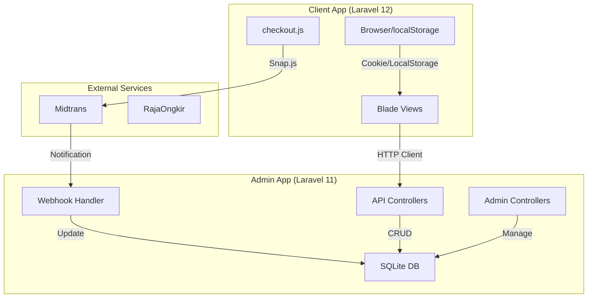

# Laporan Analisis Komprehensif Proyek WUB
**Website UPBS BRMP Biogen**

**Tanggal:** 9 Desember 2025
**Versi:** 2.0 (Re-Analysis)

---

## 1. Ringkasan Eksekutif

### Gambaran Umum
Proyek WUB adalah sistem e-commerce B2C/B2B untuk penjualan benih sumber (UPBS) yang terdiri dari dua repositori terpisah:
- **Admin Panel** (`upbs_biogen-admin`): Backend API + Admin Dashboard
- **Client App** (`upbs_biogen-client`): Frontend Storefront untuk pelanggan

### Teknologi Stack

| Komponen | Admin | Client |
|:---------|:------|:-------|
| **Framework** | Laravel 11.x | Laravel 12.x |
| **PHP** | 8.2+ | 8.2+ |
| **Database** | SQLite (Dev) | SQLite (Session/Cache only) |
| **Frontend** | Blade Templates | Blade + Tailwind CSS 4.x |
| **JS Framework** | Vanilla JS | Vanilla JS |
| **Build Tool** | Vite | Vite 7.x |
| **Payment** | Midtrans SDK | Midtrans Snap |

### Status Git
- **Branch Aktif:** `fatih` (kedua repo)
- **Commit Terbaru Admin:** Validasi checkout BS/FS & stok lot
- **Commit Terbaru Client:** Update filter katalog & APP_URL 8001

---

## 2. Detail Teknis Repo Admin

### A. Struktur Folder

```
app/
├── Console/           # Artisan commands
├── Helpers/           # RouteHelper.php, helpers.php
├── Http/
│   ├── Controllers/
│   │   ├── Admin/     # 10 controllers (OrderController 20KB)
│   │   ├── Api/       # 5 controllers (Commodity, Variety, Order, SeedClass, SeedLot)
│   │   ├── Auth/      # 8 controllers
│   │   ├── Client/    # CheckoutController
│   │   └── WebhookController.php
│   ├── Middleware/    # 4 files (EnsureAdmin, EnsureSuperAdmin, etc.)
│   └── Requests/      # Validation classes (CheckoutRequest, etc.)
├── Mail/              # OrderConfirmation, OrderStatusUpdate, ShippingInstructions
├── Models/            # 12 Eloquent models
├── Providers/         # 5 service providers
└── Services/          # MidtransService
```

### B. Model Eloquent & Relasi

| Model | Relasi | Catatan |
|:------|:-------|:--------|
| **Order** | HasMany(OrderItem), HasOne(Payment), HasOne(Shipment), HasMany(AuditLog) | 388 lines, full state machine |
| **Variety** | BelongsTo(Commodity), HasMany(SeedLot) | Stock calculated from SeedLots |
| **SeedLot** | BelongsTo(Variety), BelongsTo(SeedClass) | `is_sellable` flag, cache clearing |
| **Payment** | BelongsTo(Order) | Midtrans status mapping |
| **Commodity** | HasMany(Variety) | Kategori utama (Padi, Jagung, dll) |
| **SeedClass** | HasMany(SeedLot) | BS, FS, SS, ES, PL |
| **AuditLog** | BelongsTo(User) | 8 kategori logging |

### C. API Endpoints ([routes/api.php](file:///c:/laragon/www/upbs_biogen-admin/routes/api.php))

```php
// Public API (throttle:20,1)
GET  /commodities           // List semua komoditas
GET  /varieties             // List semua varietas (dengan stok)
GET  /varieties/{slug}      // Detail varietas
GET  /seed-classes          // List kelas benih
GET  /seed-lots             // List lot benih
POST /orders/checkout       // Proses checkout (guest)
GET  /orders/track/{tracking_number}     // Lacak pesanan
GET  /orders/{order_code}/payment/status // Cek status pembayaran
```

### D. Web Routes (Admin Panel)

```php
// Guest
GET/POST /login

// Admin (role 1 & 2)
/admin/dashboard
/admin/commodities     # CRUD
/admin/varieties       # CRUD
/admin/seed-classes    # CRUD
/admin/seed-lots       # CRUD
/admin/orders          # Index, Show, Status Update, Cancel, Export
/admin/audit-logs      # View only

// Super Admin Only (role 1)
/admin/admin-users     # Manage admin users
```

### E. Middleware

| Middleware | Fungsi |
|:-----------|:-------|
| [EnsureAdmin](file:///c:/laragon/www/upbs_biogen-admin/app/Http/Middleware/EnsureAdmin.php#8-35) | Izinkan role_id 1 (super_admin) dan 2 (admin) |
| [EnsureSuperAdmin](file:///c:/laragon/www/upbs_biogen-admin/app/Http/Middleware/EnsureSuperAdmin.php#8-34) | Hanya role_id 1 untuk manajemen user |
| `ValidateSession` | Validasi session (8KB) |

### F. Validasi Checkout ([CheckoutRequest.php](file:///c:/laragon/www/upbs_biogen-admin/app/Http/Requests/CheckoutRequest.php))

**Aturan Khusus:**
- **BS (Benih Sumber):** Quantity harus kelipatan 5 kg
- **FS (Foundation Seed):** Minimal 1 kg
- Validasi `is_sellable` dan stok lot sebelum proses

### G. Database Migrations (35 files)

**Tabel Utama:**
- `users`, `roles`, `sessions`
- `commodities`, `varieties`, `seed_classes`, `seed_lots`
- `orders`, `order_items`, `payments`, `shipments`, `audit_logs`

**Perubahan Signifikan:**
- Categories → Commodities
- Products → Varieties
- Penambahan kolom Midtrans untuk Payments

### H. Integrasi Midtrans

**Service:** `App\Services\MidtransService`
- Basic Auth dengan Server Key
- Endpoint: `https://api.sandbox.midtrans.com/v2/{order_id}/status`

**Webhook:** [WebhookController](file:///c:/laragon/www/upbs_biogen-admin/app/Http/Controllers/WebhookController.php#15-269)
- Verifikasi signature SHA512
- Logging ke channel `webhooks`
- Auto-send email `OrderStatusUpdate`

---

## 3. Detail Teknis Repo Client

### A. Struktur Folder

```
app/Http/Controllers/
├── CatalogController.php    # 9KB - Proxy ke Admin API + caching
├── CheckoutController.php   # 2KB - Proxy checkout + payment pages
├── TrackOrderController.php # 3.5KB - Lacak pesanan (3 metode)
├── CartController.php       # 182B - Placeholder
└── varietas_controller.php  # 126B - Unused?

resources/
├── views/
│   ├── layouts/            # app.blade.php, etc.
│   ├── components/         # cart-modal, form-checkout, navbar
│   ├── checkout.blade.php  # 285 lines, Midtrans Snap
│   ├── track-order.blade.php
│   ├── order-detail.blade.php
│   ├── invoice.blade.php
│   ├── receipt.blade.php
│   ├── payment-success.blade.php
│   ├── payment-error.blade.php
│   └── welcome.blade.php   # 82KB landing page
├── js/
│   ├── app.js              # Bootstrap
│   ├── bootstrap.js        # Axios config
│   ├── cart.js             # Cart logic (localStorage)
│   ├── checkout.js         # 370 lines, Midtrans Snap
│   ├── produk.js           # Product detail
│   ├── print.js            # Print functionality
│   └── categoryScroll.js
└── css/
    └── app.css             # Tailwind 4.x
```

### B. Routes ([routes/web.php](file:///c:/laragon/www/upbs_biogen-admin/routes/web.php))

```php
GET  /                     # Home (CatalogController)
GET  /katalog              # Catalog
GET  /produk/{slug}        # Product detail
GET  /checkout             # Checkout page
POST /checkout/process     # Proxy ke Admin API
GET  /payment/finish       # Midtrans callback success
GET  /payment/error        # Midtrans callback error
GET  /cek-pesanan          # Track order form
GET  /pesanan/{order_code} # Order detail
GET  /pesanan/{order_code}/cetak # Print invoice/receipt
GET  /tentang-kami         # About page
```

### C. Cart & Checkout Flow

1. **Cart Storage:**
   - LocalStorage key: `upbs_cart_v2`
   - Format: `{ items: [...] }`
   - Tidak ada sync ke database sampai checkout

2. **Receiver Data:**
   - Cookie: `upbs_receiver_data` (30 hari)
   - Fields: name, phone, email, address, province, city, district, postal, shipping_method

3. **Checkout Process:**
   - JS mengirim POST ke `/checkout/process`
   - Controller proxy ke Admin API `/api/orders/checkout`
   - Admin return `snap_token`
   - Client membuka Midtrans Snap popup
   - Callback: success → `/orders/success`, error → `/orders/error`

4. **Service Fee:** 1% dari subtotal

### D. API Caching Strategy

| Data | TTL | Sumber |
|:-----|:----|:-------|
| Varieties | 30 menit | Admin API |
| Commodities | 1 jam | Admin API |

### E. Track Order Feature

**3 Metode Pencarian:**
- Tracking Number (default)
- Order Code
- Phone Number

**Views:**
- [track-order.blade.php](file:///c:/laragon/www/upbs_biogen-client/resources/views/track-order.blade.php): Form + hasil
- [order-detail.blade.php](file:///c:/laragon/www/upbs_biogen-client/resources/views/order-detail.blade.php): Detail lengkap
- [invoice.blade.php](file:///c:/laragon/www/upbs_biogen-client/resources/views/invoice.blade.php): Invoice (belum bayar)
- [receipt.blade.php](file:///c:/laragon/www/upbs_biogen-client/resources/views/receipt.blade.php): Kwitansi (sudah bayar)

---

## 4. Integrasi & Keamanan

### A. CORS Configuration ([config/cors.php](file:///c:/laragon/www/upbs_biogen-admin/config/cors.php))

```php
'allowed_origins' => [
    'http://localhost:8001',
    'http://127.0.0.1:8001',
],
'paths' => ['api/*', 'sanctum/csrf-cookie'],
'supports_credentials' => false,
```

### B. Rate Limiting

- API: `throttle:20,1` (20 request per menit)
- Applied to: commodities, varieties, checkout, track

### C. Authentication

- **Admin Panel:** Session-based (Laravel default)
- **API Public:** Tidak ada auth token (guest checkout)
- **Webhook:** Signature verification (SHA512)

### D. Error Handling

- `ConnectionException` di Client → 503 page
- API errors → JSON response dengan status code
- Checkout errors → Shown in UI via JS

---

## 5. Temuan & Rekomendasi

### A. Catatan Positif ✅

1. **Clean Architecture:** Pemisahan Admin (API) dan Client (Frontend) baik
2. **Checkout Validation:** Aturan BS/FS sudah diimplementasi dengan benar
3. **Audit Logging:** Comprehensive dengan 8 kategori
4. **State Machine Order:** Status transitions terdefinisi dengan baik
5. **Caching:** Mengurangi beban API dengan smart caching

### B. Area Perbaikan ⚠️

1. **Hardcoded Midtrans Client Key:**
   ```html
   <!-- checkout.blade.php line 8 -->
   data-client-key="Mid-client-0HeQjinK75x-iLk0"
   ```
   → Pindahkan ke environment variable `VITE_MIDTRANS_CLIENT_KEY`

2. **Shipping Cost:** 
   - Saat ini selalu 0 (tidak dihitung otomatis)
   - RajaOngkir API key ada di .env tapi tidak dipakai
   - Admin menghubungi customer secara manual untuk ongkir

3. **Stock Sync Issue:**
   - Client cache 30 menit = potensi stok tidak akurat
   - Solusi: Real-time check saat checkout

4. **Laravel Version Client:**
   - Menggunakan Laravel 12 (dev/bleeding edge)
   - Potensi instabilitas di production

5. **Missing API Routes di Client:**
   - Route `/orders/checkout` tidak ada, perlu proxy via `/checkout/process`
   - Route `/orders/success` dan `/orders/pending` tidak ditemukan

### C. Potensi Bug 🐛

1. **Duplicate Orders:**
   - Jika user menutup Snap popup dan submit ulang
   - Perlu idempotency key

2. **Email Optional tapi Required:**
   - CheckoutRequest: `customer_email => 'required|email'`
   - Checkout UI: "Email (Opsional)"
   - **Mismatch!**

3. **Cart Key Inconsistency:**
   - [cart.js](file:///c:/laragon/www/upbs_biogen-client/resources/js/cart.js): menggunakan `cart`
   - [checkout.js](file:///c:/laragon/www/upbs_biogen-client/resources/js/checkout.js): menggunakan `upbs_cart_v2`
   - **Data tidak sinkron!**

### D. Saran Pengembangan Berikutnya 📋

1. **Ongkir Integration:** Implementasi RajaOngkir untuk auto-calculate
2. **Payment Polling:** Auto-refresh status pembayaran di client
3. **API Documentation:** Swagger/OpenAPI untuk tim frontend
4. **Email Templates:** Design email konfirmasi yang lebih profesional
5. **Mobile Responsiveness:** Test dan optimize untuk mobile
6. **Production Config:** Setup environment production (non-sandbox Midtrans)

---

## 6. Diagram Arsitektur



---

*Laporan ini disusun berdasarkan analisis statis kode sumber. Tidak ada perubahan kode yang dilakukan.*
